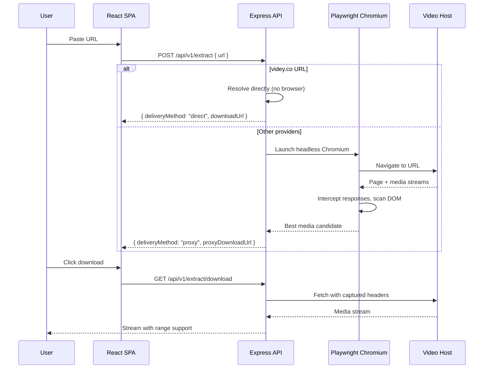

<div align="center">
  
  <h1>Universal Downloader</h1>
  <p><strong>Extract direct video sources from video hosting sites</strong></p>

  <p>
    
    
    
    
    
  </p>
  <p>
    
    
    
    
    <a href="https://render.com"></a>
  </p>
</div>

---

## Demo


*A minimalist dark-themed interface. Paste a video URL → get a direct download link.*

---

## Features

- **🎯 Multi-provider extraction** — Supports `videqs.download`, `playvvip.top`, `fwh.is`, and `videy.co`
- **⚡ Direct resolution** — Videy.co URLs resolved instantly without launching a browser
- **🕵️ Smart media detection** — Playwright headless Chrome intercepts network traffic and scans DOM for media sources
- **📊 Heuristic scoring** — 15+ scoring rules to pick the best media candidate while filtering ads and trackers
- **🔒 Production-grade security** — Helmet, CORS, rate limiting, Zod input validation, structured error handling
- **📦 Proxy download** — Streams media through the backend with proper headers, supporting range requests
- **🧪 Comprehensive testing** — 99 tests (unit + integration), 90%+ coverage
- **🐳 Docker ready** — One-command setup with Docker Compose

---

## Tech Stack

| Layer | Technology |
|---|---|
| **Backend** | Express 5, TypeScript (strict), Playwright 1.42, Zod 4, Pino |
| **Frontend** | React 19, Vite 8, Tailwind CSS 3, shadcn/ui, Lucide icons |
| **Testing** | Vitest, Supertest, V8 coverage |
| **DevOps** | Docker Compose, Husky, lint-staged |

---

## Architecture



### Module Structure

```
backend/
├── src/
│   ├── index.ts                      # Express app entry
│   ├── config.ts                     # Zod-validated environment
│   ├── logger.ts                     # Pino structured logger
│   └── extractor/
│       ├── errors.ts                 # Custom error classes
│       ├── helpers.ts                # 17 pure utility functions
│       ├── schemas.ts                # Input validation schemas
│       ├── browser.ts                # Playwright lifecycle
│       ├── routes.ts                 # Route handlers
│       └── providers/
│           └── videy.ts              # Videy direct resolver
└── src/__tests__/                    # 99 tests (Vitest)
    ├── helpers.test.ts
    ├── schemas.test.ts
    └── routes.test.ts
```

---

## Quick Start

### Prerequisites

- **Node.js** >= 22
- **npm** >= 10
- **Playwright Chromium** (for browser-based extraction)
- **Docker** (optional, for containerized setup)

### Local Development

```bash
# 1. Clone the repository
git clone https://github.com/YOUR_USERNAME/link-download.git
cd link-download

# 2. Install & build backend
cd backend
npm install
npm run build

# 3. Install Playwright browser
npm run playwright:install

# 4. Start backend
npm run dev

# 5. In another terminal — install & start frontend
cd frontend
npm install
npm run dev
```

Frontend runs on `http://localhost:5173`, backend on `http://localhost:3001`.

### Docker (One Command)

```bash
docker compose up
```

Both services start with hot-reload enabled.

---

## API Reference

### `POST /api/v1/extract`

Extract a downloadable video URL from a supported provider.

**Request:**
```json
{
  "url": "https://videqs.download/abc123"
}
```

**Success Response (200):**
```json
{
  "meta": { "status": 200, "message": "Success" },
  "data": {
    "title": "Extracted Video Title",
    "downloadUrl": "https://cdn.provider.com/video.mp4",
    "headersRequired": { "referer": "https://source.com/", "user-agent": "..." },
    "expiresIn": 3600,
    "provider": "videqs",
    "deliveryMethod": "proxy",
    "directDownloadUrl": null,
    "proxyDownloadUrl": "/api/v1/extract/download?source=..."
  },
  "error": null
}
```

| Status | Meaning |
|---|---|
| `200` | Video extracted successfully |
| `400` | Invalid URL or unsupported domain |
| `404` | No media stream found on the page |
| `429` | Rate limited (5 requests/minute/IP) |
| `503` | Playwright browser not installed |

### `GET /api/v1/extract/download`

Proxy download a media stream. Used internally by the `proxyDownloadUrl` field.

**Query Parameters:**

| Param | Required | Description |
|---|---|---|
| `source` | ✅ | Direct media URL from extraction |
| `headers` | ✅ | Base64url-encoded JSON of required request headers |
| `filename` | ❌ | Custom filename for the downloaded file |

**Response:** Streams the media file with proper `Content-Disposition`, `Content-Type`, `Accept-Ranges`, and `Content-Length` headers. Supports partial content (range requests).

---

## Testing

```bash
cd backend

# Run all tests
npm test

# Run with coverage
npm run test:coverage

# Watch mode
npm run test:watch
```

**Current coverage:**

| Metric | Coverage |
|---|---|
| Statements | 90.01% |
| Branches | 86.06% |
| Functions | 92.30% |
| Lines | 90.01% |

---

## Deployment

### Render (Docker)

The project includes a `render.yaml` for one-click deployment on Render:

```yaml
services:
  - type: web
    name: link-download-backend
    env: docker
    dockerContext: backend
    dockerfilePath: backend/Dockerfile
    envVars:
      - key: PORT
        value: 3000
    autoDeploy: true
    branch: main
```

### Environment Variables

| Variable | Default | Description |
|---|---|---|
| `PORT` | `3001` | Backend server port |
| `NODE_ENV` | `development` | `development`, `production`, or `test` |
| `ALLOWED_ORIGINS` | `*` | Comma-separated CORS origins |
| `LOG_LEVEL` | `info` | Pino log level: `debug`, `info`, `warn`, `error`, `fatal`, `trace`, `silent` |
| `RATE_LIMIT_WINDOW_MS` | `60000` | Rate limit window in milliseconds |
| `RATE_LIMIT_MAX` | `5` | Max requests per window per IP |
| `VITE_BACKEND_URL` | `http://localhost:3001` | Frontend → backend proxy target |

---

## Project Status

- ✅ **Core extraction** — Fully functional for all 4 supported providers
- ✅ **Security** — Helmet, CORS, rate limiting, input validation, typed errors
- ✅ **Testing** — 99 tests, 90%+ coverage
- ✅ **Developer experience** — TypeScript strict, Husky pre-commit hooks, Docker Compose
- ⏳ **Frontend deployment** — Not yet configured (Vercel/Netlify ready)

---

## License

[MIT](LICENSE.md)

---

<div align="center">
  <sub>Built with TypeScript, React, Express, and Playwright.</sub>
</div>
