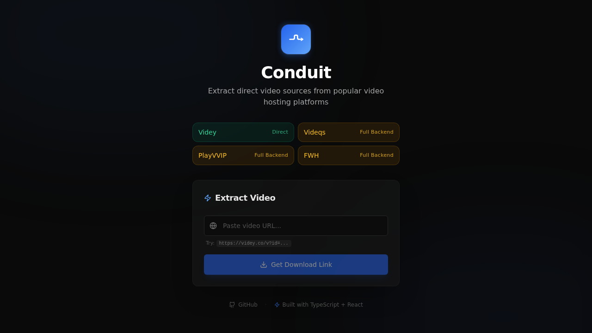

<div align="center">

  

  <h1>Conduit</h1>

  <p><strong>Extract direct video sources from popular hosting platforms.</strong></p>

  <p>
    <a href="https://conduit-iota-rust.vercel.app">
      
    </a>
    <a href="https://github.com/codespaces/new?repo=mifdlaldev/conduit">
      
    </a>
    <a href="https://github.com/mifdlaldev/conduit/blob/main/LICENSE.md">
      
    </a>
  </p>

  <p>
    
    
    
    
    
    
    
  </p>

  <br>

  

</div>

---

## Try It Now

### ✅ Works on Live Demo
```bash
# Click the link below — no installation needed
https://conduit-iota-rust.vercel.app
```

Paste this test URL into the input field:
```
https://videy.co/v?id=o8KUmW4
```

### 🔧 Full Extraction (All Providers)

| Method | Providers | Cost | Setup Time |
|---|---|---|---|
| **[GitHub Codespaces](https://github.com/codespaces/new?repo=mifdlaldev/conduit)** | ✅ All 4 providers | Free (60h/month) | 1 click |
| **[Docker](https://github.com/mifdlaldev/conduit#quick-start)** | ✅ All 4 providers | Free (forever) | ~2 minutes |
| **Local CLI** | ✅ All 4 providers | Free (forever) | ~3 minutes |

---

## Features

- **Multi-provider** — Supports `videqs.download`, `playvvip.top`, `fwh.is`, and `videy.co`
- **Direct resolution** — `videy.co` URLs resolved instantly (no browser needed)
- **Smart detection** — Playwright headless Chrome intercepts network traffic and scans DOM for media sources
- **Heuristic scoring** — 15+ rules to select the best media candidate while filtering ads and trackers
- **Proxy download** — Streams media with proper headers and range request support
- **Production-grade security** — Helmet, CORS, rate limiting, Zod input validation, structured error handling
- **99 tests** — Unit + integration, 90%+ line coverage
- **Docker ready** — One-command setup with `docker compose up`

---

## Tech Stack

| Layer | Technology |
|---|---|
| **Frontend** | React 19, Vite 8, Tailwind CSS 3, shadcn/ui, Lucide icons |
| **Backend** | Express 5, TypeScript (strict), Playwright 1.42, Zod 4, Pino |
| **Testing** | Vitest, Supertest, V8 coverage |
| **CI/CD** | GitHub Actions, Vercel |
| **DevOps** | Docker Compose, Husky, lint-staged |

---

## Why This Architecture?

### The Core Problem

This project uses **Playwright** (headless Chromium) to extract video streams. Chromium is a ~300MB binary needing 1-2GB of RAM. Most free hosting platforms cannot run it:

| Platform | Free Tier | Playwright-Compatible | Hidden Cost |
|---|---|---|---|
| Vercel | ✅ Free, no CC | ❌ 10s timeout, no persistent processes | — |
| Netlify | ✅ Free, no CC | ❌ No headless browser support | — |
| Render | ✅ 750h/month | ✅ Runs Docker | 512MB RAM limit, $5/month if exceeded |
| Fly.io | ✅ 3 shared VMs | ✅ Runs Docker | Requires credit card |
| Railway | ❌ $5 credit then pay | ✅ Runs Docker | Requires credit card |

### The Solution: Hybrid Architecture

```
┌──────────────────────────────────────┐
│         Vercel (Free, No CC)         │
│                                      │
│  ┌──────────────────────────────┐    │
│  │  Frontend (React SPA)        │    │  Always UP
│  └──────────────────────────────┘    │
│  ┌──────────────────────────────┐    │
│  │  Serverless API              │    │  videy.co direct resolve
│  │  /api/v1/extract             │    │  (no Playwright needed)
│  └──────────────────────────────┘    │
└──────────┬───────────────────────────┘
           │ (non-videy providers)
           ▼
┌──────────────────────────────────────┐
│  GitHub Codespaces / Local (Free)    │
│                                      │
│  ┌──────────────────────────────┐    │
│  │  Full Backend + Playwright   │    │  All 4 providers
│  └──────────────────────────────┘    │
└──────────────────────────────────────┘
```

### Engineering Rationale

1. **Pragmatism** — The live demo showcases the product and the `videy.co` flow. Full functionality is one click away in Codespaces.
2. **Zero cost guarantee** — No credit card required at any layer. No surprise bills.
3. **Always accessible** — The Vercel frontend is up 24/7. Only Playwright-dependent providers need the full backend.
4. **Transparent** — Users know upfront which providers work on the demo.

---

## Quick Start

### Option 1: GitHub Codespaces (1 Click)

[](https://github.com/codespaces/new?repo=mifdlaldev/conduit)

Click the badge above. Codespaces auto-installs everything including Playwright Chromium. 60 hours/month free, no credit card.

### Option 2: Local Development

```bash
# Prerequisites: Node.js >= 22, npm >= 10
git clone https://github.com/mifdlaldev/conduit.git
cd conduit

# Backend
cd backend
npm install
npm run playwright:install  # Installs Chromium
npm run dev                  # → localhost:3001

# Frontend (new terminal)
cd ../frontend
npm install
npm run dev                  # → localhost:5173
```

### Option 3: Docker

```bash
docker compose up
```

---

## Quick Test

### Test the Live API

```bash
# videy.co — should return 200 with direct download URL
curl -X POST https://conduit-iota-rust.vercel.app/api/v1/extract \
  -H "Content-Type: application/json" \
  -d '{"url":"https://videy.co/v?id=o8KUmW4"}'

# Non-videy provider — should return 501 with setup instructions
curl -X POST https://conduit-iota-rust.vercel.app/api/v1/extract \
  -H "Content-Type: application/json" \
  -d '{"url":"https://videqs.download/test"}'
```

### Test Locally (Full Backend)

```bash
cd backend
npm test            # 99 tests
npm run test:coverage  # 90%+ coverage
```

---

## API Reference

### POST /api/v1/extract

Extract a video URL from a supported provider.

**Request:**
```json
{ "url": "https://videqs.download/abc123" }
```

**Success (200):**
```json
{
  "meta": { "status": 200, "message": "Success" },
  "data": {
    "title": "Video Title",
    "downloadUrl": "https://cdn.provider.com/video.mp4",
    "provider": "videqs",
    "deliveryMethod": "proxy",
    "proxyDownloadUrl": "/api/v1/extract/download?source=..."
  }
}
```

| Status | Meaning |
|---|---|
| `200` | Video extracted successfully |
| `400` | Invalid URL or unsupported domain |
| `404` | No media stream found |
| `429` | Rate limited (5 req/min) |
| `501` | Provider needs full backend (Playwright) |
| `503` | Playwright browser not installed |

### GET /api/v1/extract/download

Proxy download a media stream.

| Param | Required | Description |
|---|---|---|
| `source` | ✅ | Direct media URL from extraction |
| `headers` | ✅ | Base64url-encoded JSON of request headers |
| `filename` | ❌ | Custom filename |

Supports range requests for resumable downloads.

---

## Project Structure

```
conduit/
├── frontend/
│   ├── api/v1/extract.ts       # Serverless function (videy.co resolve)
│   ├── src/
│   │   ├── App.tsx              # Main UI with dark theme + glassmorphism
│   │   ├── components/ui/       # shadcn/ui components
│   │   └── lib/utils.ts         # cn() utility
│   ├── vercel.json              # Vercel config
│   └── package.json
├── backend/
│   ├── src/
│   │   ├── index.ts             # Express app entry
│   │   ├── config.ts            # Zod-validated environment
│   │   ├── logger.ts            # Pino structured logger
│   │   └── extractor/
│   │       ├── errors.ts        # Custom error classes
│   │       ├── helpers.ts       # 17 pure utility functions
│   │       ├── schemas.ts       # Input validation
│   │       ├── browser.ts       # Playwright lifecycle
│   │       ├── routes.ts        # Route handlers
│   │       └── providers/
│   │           └── videy.ts     # Videy direct resolver
│   └── src/__tests__/           # 99 tests (Vitest)
└── .github/workflows/ci.yml     # CI pipeline
```

---

## Testing

```bash
cd backend
npm test             # 99 tests, all passing
npm run test:coverage  # 90%+ line coverage
```

| Metric | Coverage |
|---|---|
| Statements | 90.01% |
| Branches | 86.06% |
| Functions | 92.30% |
| Lines | 90.01% |

---

## Environment Variables

| Variable | Default | Description |
|---|---|---|
| `PORT` | `3001` | Backend server port |
| `NODE_ENV` | `development` | `development`, `production`, or `test` |
| `ALLOWED_ORIGINS` | `*` | Comma-separated CORS origins |
| `LOG_LEVEL` | `info` | Pino log level |
| `VITE_BACKEND_URL` | `http://localhost:3001` | Frontend → backend proxy |

---

## Changelog

See [CHANGELOG.md](CHANGELOG.md).

## License

[MIT](LICENSE.md)

---

<div align="center">
  <sub>
    Built with TypeScript, React, Express, and Playwright.<br>
    Designed for zero-cost, no-CC deployment.
  </sub>
</div>
